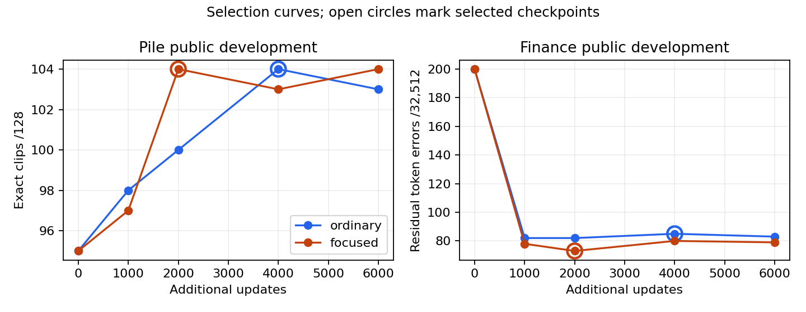

# TRR-0013 — Focused public practice versus ordinary continuation

**Decision: ordinary continuation explains the gain.**

On the preregistered primary Pile/public-base comparison, focused minus ordinary is +0.39 percentage points (conservative 95% bounds -3.28 to +4.05; 17 gained, 15 regressed clips); token delta -0.008 points. Ordinary minus frozen B1 is +8.20 percentage points (conservative 95% bounds +3.84 to +12.41; 49 gained, 7 regressed clips); token delta +0.175 points. The practical threshold was +5 exact-clip percentage points, with a positive paired lower bound and the registered Pile/Finance safeguards. These are exploratory results from one sampler and one continuation seed; inconclusive intervals are not evidence of equivalence.

The primary focused-versus-ordinary upper bound is +4.05 points, below the registered +5-point useful gain for this frozen pair. The shifted-target upper bound is +5.49 points, so that target-specific +5-point effect is not excluded. Ordinary meets the registered point-and-evidence criterion; its interval does not establish that its true gain is at least five points.

All three decoders use the preserved, rebuilt TRR-0012 B1, not the lost PR20 checkpoint. The starting selected-state SHA-256 is `088be6a6b2842d526f3dab39789728d9cfc23f2fb1fb892d107d46ade2382706`; fixed public readout SHA-256 is `ad4201381ec062f0ece1ed007f6a003503e57ef4384271361059f0cc781fdcf1`. Exact identities, new selected states, source files, and executed-code bindings are retained in the manifest. No A2 fallback, teacher objective, learned readout, new architecture, global registry change, or merge was introduced.

The independent natural panel contains **512 Pile and 256 Finance sources**, paired across public-base and historical synthetic-LoRA target states: **768 independent sources and 1,536 source/target observations**. Exact recovery means all 127 scored post-BOS tokens in the declared 128-token clip, not the full source document.

| Cell | Method | Token accuracy | Token errors | Exact clips |
|---|---|---:|---:|---:|
| pile__public_base | Frozen B1 | 99.388% | 398 | 335/512 |
| pile__public_base | Ordinary | 99.563% | 284 | 377/512 |
| pile__public_base | Focused | 99.556% | 289 | 379/512 |
| pile__public_lora_2601 | Frozen B1 | 99.431% | 370 | 338/512 |
| pile__public_lora_2601 | Ordinary | 99.599% | 261 | 375/512 |
| pile__public_lora_2601 | Focused | 99.592% | 265 | 383/512 |
| finance__public_base | Frozen B1 | 99.908% | 30 | 238/256 |
| finance__public_base | Ordinary | 99.994% | 2 | 254/256 |
| finance__public_base | Focused | 99.982% | 6 | 251/256 |
| finance__public_lora_2601 | Frozen B1 | 99.917% | 27 | 239/256 |
| finance__public_lora_2601 | Ordinary | 99.988% | 4 | 252/256 |
| finance__public_lora_2601 | Focused | 99.978% | 7 | 249/256 |

Paired focused-minus-ordinary results preserve source pairing. Token intervals use 10,000 source bootstrap draws; the same source indices are shared across target conditions. Exact bounds use the unchanged paired discordance Clopper–Pearson procedure. No pooled-source or simultaneous-coverage claim is made.

| Cell | Exact change, pp [bounds] | Gained / regressed clips | Token change, pp [95% interval] | Token gains / regressions |
|---|---:|---:|---:|---:|
| pile__public_base | +0.39 [-3.28, +4.05] | 17 / 15 | -0.008 [-0.048, +0.026] | 47 / 52 |
| pile__public_lora_2601 | +1.56 [-2.39, +5.49] | 23 / 15 | -0.006 [-0.046, +0.028] | 47 / 51 |
| finance__public_base | -1.17 [-3.75, +1.51] | 0 / 3 | -0.012 [-0.028, +0.000] | 0 / 4 |
| finance__public_lora_2601 | -1.17 [-3.75, +1.51] | 0 / 3 | -0.009 [-0.022, +0.000] | 0 / 3 |

Decision checks are fully enumerated in `score_r1.json`. Finance safeguards are prospective point-loss limits of 0.05 token percentage points against ordinary and frozen B1 on each target; passing them is not a formal noninferiority claim.

The bounded A1+A2 anchor uses the **same first 64 sources per domain per target**: 128 independent sources and 256 source/target observations. It is separate from the full-panel denominator. The following differences are A1+A2 minus each standalone method on those identical records.

| Cell | Standalone control | A1 exact advantage, pp | A1 token advantage, pp | A1 exact clips /64 |
|---|---|---:|---:|---:|
| pile__public_base | Frozen B1 | +31.25 | +0.406 | 55 |
| pile__public_base | Ordinary | +21.88 | +0.234 | 55 |
| pile__public_base | Focused | +21.88 | +0.221 | 55 |
| pile__public_lora_2601 | Frozen B1 | +29.69 | +0.381 | 55 |
| pile__public_lora_2601 | Ordinary | +26.56 | +0.221 | 55 |
| pile__public_lora_2601 | Focused | +23.44 | +0.308 | 55 |
| finance__public_base | Frozen B1 | +6.25 | +0.074 | 64 |
| finance__public_base | Ordinary | +1.56 | +0.012 | 64 |
| finance__public_base | Focused | +3.12 | +0.025 | 64 |
| finance__public_lora_2601 | Frozen B1 | +3.12 | +0.037 | 64 |
| finance__public_lora_2601 | Ordinary | +1.56 | +0.012 | 64 |
| finance__public_lora_2601 | Focused | +1.56 | +0.012 | 64 |

The original fitting bank was effectively memorized: **21 errors /1,243,710 positions**, with 99th-percentile CE 0.00567. This met the rule fixed before that diagnostic, so both arms received one identical additional pool of 1,024 natural Pile and 1,024 natural Finance records. B1 initially made **1,419 errors /387,348 positions** there, with 99th-percentile CE 0.38159. The correction pool was chosen independently of evaluation answers. Published identity exclusions, relevant sequence duplicates, and other studies’ reservations were applied before natural deterministic selection. The resulting population is conditional on those exclusions; it is not frequency balanced. No P03 holdout or another study’s hidden answers were accessed.

Both arms completed 6,000 updates with identical eight-record batches, 512 token draws per update, the same fixed readout and full-vocabulary CE, fresh AdamW/cosine schedule, and the same five public validation opportunities. Focused sampling retains the first 256 ordinary draws and samples 256 positions with replacement from the batch’s initial-loss top quintile. Difficulty remains frozen; there is no importance correction. This deliberately changes CE weighting, including the amount of correction-pool exposure.

Across the full search budget, ordinary/focused each used 3,072,000 draws and 13,603 unique records. Unique token positions were 1,383,154/1,115,611; maximum repetition 11/33; correction draws 698,780/772,666. Bins use actual combined-bank token frequencies, not B0 support assumptions.

Public validation selected ordinary update 4,000 and focused update 2,000 after both full schedules were completed. Thus selected weights incorporate 2,048,000 versus 1,024,000 draws; total search budgets and selection opportunities are equal. Both selected models recover 104/128 Pile development clips, versus 95/128 for B1. The common-token and rare/unseen-token curves are retained in the fit receipts; final evaluation was not used to choose either checkpoint.

Inference costs below use the identical common 64-record subsets, one warmup and three measured per-record calls. Timing includes H transfer, prediction, returned IDs, synchronization, and the common resource check. All repeated predictions agree exactly. Cold load is the in-process model/resource load phase with warm filesystem caches; interpreter startup and cache eviction are not measured. Figures come from one ordered local run and do not establish a small speed difference among identical decoder architectures.

| Method | Warm median, ms/clip | Cold load, s | Peak GPU reserved, GiB | Additional fit wall, s | Runtime components |
|---|---:|---:|---:|---:|---|
| Frozen B1 | 4.500 | 0.752 | 1.260 | 0.00 | H + 29.39 MB decoder + 1,050.67 MB fixed E |
| Ordinary | 4.488 | 0.556 | 1.260 | 264.36 | H + 29.39 MB decoder + 1,050.67 MB fixed E |
| Focused | 4.567 | 0.571 | 1.260 | 250.73 | H + 29.39 MB decoder + 1,050.67 MB fixed E |
| A1+A2 | 1017.887 | 11.775 | 5.016 | 0.00 | H + frozen A1 lens/E + public prefix + K256 simulation |

Incremental shared preparation comprised 59.81 s for the original-bank diagnostic, 18.65 s correction selection, 22.28 s correction capture, and 24.10 s combined new-pool difficulty/schedule preparation. That last figure bounds difficulty computation jointly with schedule construction; it is not a separately measured pure scoring cost. The 20-update qualifier was discarded. Native updates took 233.41 s ordinary and 214.79 s focused; fit wall additionally includes loading/cache, validation, checkpoint I/O and verification. Peak fit reserved GPU was 2.91 GiB and peak host RSS about 12.40 GiB. Evaluation selection/capture were 17.34/15.26 s; comparative timing repetitions are research measurement overhead.

These are incremental costs from an already trained B1. The published TRR-0012 predecessor reports 3,030.35 s for its B0+B1 fit pair plus 250.50 s distinct preparation; that joint inherited cost is not attributed entirely to B1 or counted as new training here. A1’s historical lens preparation was reused, not remeasured. Standalone reconstruction needs no public-prefix execution or target weights.

Every grid model/optimizer was saved persistently; selected models and code were packaged, copied to Windows, and restored to a clean directory. The 1,139,454,705-byte package matched file-for-file, and all three restored models reproduced all four public smoke records exactly. Prediction completeness, shapes, token ranges, source order, actual observations, method state and code bindings were checked before truth. Negative tests covered missing methods/cells, reordered sources, modified code, wrong dtype/shape and out-of-range IDs. The early synthetic end-to-end check passed.

The first bank diagnostic failed because CE received int32 labels; the preserved failure was corrected to the native int64-label convention before completion. No failed checkpoint was selected. Original-bank scores and unchanged native training/inference components were reused. Source-tokenizer length warnings do not alter the declared 192-token capture/128-token evaluation clip. No resource anomaly or paid compute occurred.

The focused checkpoint looked better on public development token errors: Pile57 versus62 and Finance73 versus85 for ordinary. At actual fitting support counts0/1–5/6–50/>50, Pile development errors were20/16/18/3 focused versus19/18/19/6 ordinary (baseline22/25/29/5). Finance errors were8/8/53/4 versus9/6/61/9 (baseline15/8/159/18). Fresh token errors instead favor ordinary in all four cells. That supports a limitation in fresh-data generalization for this fixed priority scheme, rather than a failure to perform updates. Reduced unique exposure and checkpoint-selection noise are possible explanations, not identified causes. Target mismatch is not required for the result: the primary public-base case already fails to benefit. Capacity was held fixed and is not diagnosed. Inference cost is essentially unchanged.

The experiment distinguishes fresh-data benefit from fitting-side improvement at an equal total continuation budget. Its limits are one fixed sampler, one seed, a finite public source range conditioned on exclusions, selection checkpoints with different prefix lengths, and one historical synthetic target shift. It does not reject all hard-example methods, establish general target-transfer robustness, or make a full canonical benchmark replacement claim.

Reproduction commands and scope notes: `experiments/TRR-0013/README.md`. Structured evidence and immutable artifact hashes: `experiments/TRR-0013/manifest.json`. Package locations and clean-restore evidence: `package_preservation.json` and `restore_receipt.json` in that directory. The task branch and follow-on PR remain unmerged.

**Final decision: ordinary continuation explains the gain.** No additional sampler is launched.
