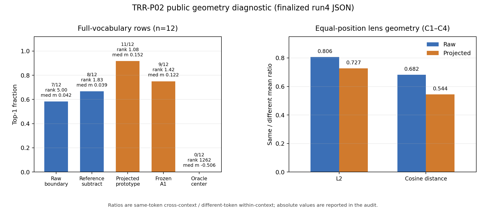

# TRR-P02 — completed public representation-geometry diagnosis

This run makes four bounded decisions. First, the equal-position C1–C4
teacher-prefix controls support context-dependent, token-specific deformation
as the most plausible explanation consistent with these controlled probes of
the P01 boundary failure. This is not a unique proof of the cause of every P01
failure. Recomputed C0 rows match the reused table exactly after dtype matching
(8/8, maximum and mean absolute difference 0), while cache checks show no
gross wiring error but do not establish rank-level cache equivalence.

Second, no deployable cheap fitting-free correction is supported. On the
restricted N9 dictionary (the known token plus eight nearest other reused P01
BOS prototypes), raw boundary gets 35/40, reference subtraction 36/40,
opposite-sign subtraction 30/40, and a public-panel mean-centering oracle
40/40. On the same predeclared 12-row subset scored against the full
vocabulary, that oracle gets 0/12. The oracle uses labels for the known public panel IDs only as a
diagnostic; it uses no private target/truth labels and is excluded from method
claims.

Third, a single streamed projection of reused P01 prototypes through the
historical frozen affine lens reaches 11/12 targeted full-V rows, versus 7/12
for raw boundary and 9/12 for historical A1. This supports further geometry
and learned-readout investigation, while compactness, generalization, and the
necessity of context or position features remain unproven. Both lens arms are
fitted comparators, not fitting-free methods.

Fourth, a concrete next mechanism is one low-rank compression of the existing
frozen affine metric/projected prototypes as a compact one-pass scorer. It
requires no new fit or A2 campaign, and its fitted origin must remain explicit.
In a separately registered check, use a predeclared public holdout separate
from the 51 captured exact tuples; stop this low-rank compression variant if
the compact form loses the projected rank or margin gain, or fails its
declared rank/margin check. P02 did not run this compression, and this is not a blanket
ban on other no-fit methods.

## Targeted full-vocabulary results

The table uses the same 12 predeclared rows (C1–C4 crossed with endpoint IDs
220, 2048, and 4096), the same full candidate vocabulary, and strict rank
`1 + count(score > true_score)`. Raw, reference, and oracle scores use `b_v`;
the projection scores `g(b_v)`; A1 scores the public input embeddings.

| variant | top-1 | mean true rank | median margin |
| --- | ---: | ---: | ---: |
| Raw boundary | 7/12 (58.3%) | 5.000 | 0.04194 |
| Reference subtraction | 8/12 (66.7%) | 1.833 | 0.03851 |
| Public mean-centered oracle | 0/12 (0.0%) | 1261.833 | -0.50581 |
| Projected frozen prototypes | 11/12 (91.7%) | 1.083 | 0.15206 |
| Historical frozen A1 | 9/12 (75.0%) | 1.417 | 0.12226 |

The reference aggregate is inflated by four self-reference rows (token 220),
all correct with margins near 0.509. Among the eight non-reference rows, raw
gets 5/8 and subtraction 4/8, so subtraction is not a general correction.
The restricted N9 scores above therefore do not establish full-V quality. A1
native scores and margins are divided by its positive `exp(s)=35.0647507` for
the cosine-equivalent values shown here; ranks are unchanged and native values
remain in the raw diagnostics.



*Reviewed summary derivative from finalized `diagnostics.json`. The geometry
panels compare public C1–C4 controls; the ranking panel includes the fitted
frozen-lens projection and historical A1 alongside raw, reference, and the
non-deployable public-panel oracle. Figure SHA-256:
`0f4160a97590ef0ab56813ef8dca954d587e872fe6e27b4896701b043341f7e1`.*

## Geometry and controls

For equal-position C1–C4 rows, raw same-token cross-context versus different-
token within-context L2 means are 3.3608024 and 4.1701951; the projected means
are 4.3329992 and 5.9581399. The corresponding cosine-distance means are
0.4820422/0.7070280 raw and 0.4652874/0.8557954 projected. Thus projection
improves relative separation (L2 ratio 0.8059→0.7272; cosine ratio
0.6818→0.5437) while increasing absolute L2 variation. Token 13 is a large
public-panel outlier: its C1–C4 offset norms are about 53.6, while other token
offsets are 1.778–4.070. Excluding it leaves 84 C1–C4 pairs with mean relative
deformation 0.881 and median 0.873 (deformation-norm mean 3.909, median
3.906), so the interpretation is not based only on that outlier.

C0 is the position-1 baseline and is excluded from the C1–C4 aggregates. C5
and C6 repeat token 13 at positions 3 and 4; they change visible content and
endpoint position together and are descriptive length controls. C6's ordered
batch-versus-single check passed for all eight endpoints (maximum and mean
absolute difference 0). Full-context cache blocks are exact; incremental
endpoint differences reach 0.00390625 and endpoint probes 0.0078125, with
persistent cache clones unchanged. The evidence supports no gross cache
problem, but no cache rank comparison was recorded, so no global bitwise or
rank-equivalence claim is made.

## Retained execution and evidence

Run4 (`470b6f1becfaa6da110048302938feddd7204c30`) ran on CPU with eight
Torch intra-op and one inter-op thread, seed 314159, and the full declared
`meta-llama/Llama-3.2-1B-Instruct` snapshot at revision
`9213176726f574b556790deb65791e0c5aa438b6`, cut depth 4, hidden size 2048,
vocabulary 128256, BF16. It ran from `2026-09-05T12:23:25Z` to
`12:23:37Z`, exited 0, and used 106 prefix calls, 30 full calls, and 76
cached calls. Internal diagnostic time was 10.8041 s; outer `/usr/bin/time`
Max RSS was 6,324,564 kB (internal peak 6,476,353,536 bytes), with no swap.
The five 8-GiB checks and 10-GiB available-memory guard passed.

The run4 replay-equivalent invocation was:

```text
env CUDA_VISIBLE_DEVICES='' OMP_NUM_THREADS=8 MKL_NUM_THREADS=8 TOKENIZERS_PARALLELISM=false /usr/bin/time -v -o /tmp/trr-p02-time-20260905-run4.txt timeout --foreground 120s python3 scripts/trr_p02/diagnose_geometry.py --plan experiments/TRR-P02/plan.json --prototype /tmp/trr-p01/experiments/TRR-P01/runtime/cpu-table-20260905/boundary_prototypes.safetensors --historical-lens /home/alanz/spartan/punim2939/Token-Reconstruction-Research/outputs/TRR-0002/strict-surrogate-heavy/control-assets/lens_alpaca.pt --model-path /home/alanz/.cache/huggingface/hub/models--meta-llama--Llama-3.2-1B-Instruct/snapshots/9213176726f574b556790deb65791e0c5aa438b6 --output-root experiments/TRR-P02/runtime/cpu-public-geometry-20260905-run4 --manifest-path experiments/TRR-P02/runtime/cpu-public-geometry-20260905-run4/run_manifest.json --implementation-commit 470b6f1becfaa6da110048302938feddd7204c30 --prototype-chunk-size 8192
```

All raw paths, including outer stdout/stderr/time receipts, are recorded in
the aggregate manifest. Primary artifacts are `activation_panel.safetensors`
(2,046,040 bytes, SHA `e63026f56063083fe009fe3211548875310dd3295e7c205f0e3759f1ae5a15ca`),
`diagnostics.json` (635,370 bytes, SHA
`7352573df457804b2702a419571a9feb100ae5863d32238eab6f38f19a9586c4`), and
`run_manifest.json` (5,816 bytes, SHA
`2ad5a6049c988940acbe0e1ef4b62320ad094c1b2e1673ca6f8e5edcc7f7f710`). The
independent reviewer is `experiments/TRR-P02/review/final-results-audit.md`
(SHA `4ff16c2fb10a4e3d4e3916ce0d6c923afbc995f214601b2b3ec6959800fdc0f3`);
`run4-summary.md` is retained as an implementation summary.

Run1 failed before geometry on the fitted-lens import (receipt SHA
`de13ed7fa7b24973d7141bb3130a773f07c0e3def6269b9af9ba879e884af43b`); run2
failed figure generation (SHA
`59fc9ba3b1805ef6961580ddecf9a89895b0eedb3fac6e253924fe453a514600`); run3
failed activation serialization (SHA
`308052ed547a4266671d6172f4c5a4fdbaef4c475465b6b6432743dc630106aa`); and a
pre-Python run4 launch failed during shell redirection (SHA
`6295147889eb6a8aa980d59af7255f9cf2eca7b8f9a81ce9f79490447370c273`). They
contribute no scientific result. The final exact-case record contains 46
scientific rows plus five qualification-only cases (51 unique exact
case/context/endpoint/sequence tuples), bound to the plan hash, and applies
no global token exclusion. Full path/size/hash inventory and compact state are
in `experiments/TRR-P02/manifest.json` and
`coordination/parallel/TRR-P02.json`; `truth_opened=false` throughout.
