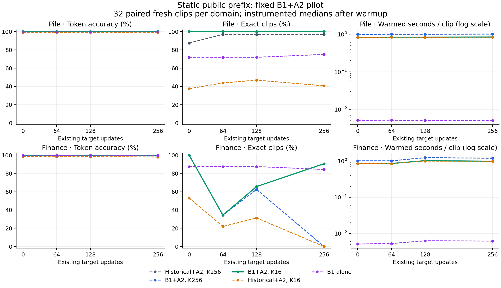

# Static-public-prefix B1+A2 hybrid pilot

B1+A2 K16 **did not meet** the predeclared combined quality and acceleration criteria throughout this paired pilot. All results below use a static public model prefix. No active prefix recovery or cold-start tracking was tested.

B1+A2 K16 met the prospective quality-loss limits in all eight conditions and reduced measured warmed time by 15.4–18.1%, but no cell reached the required 20% reduction against both K256 references. Preserve it as a limited static-prefix candidate with modest measured savings, as requested; it is not a qualified useful-acceleration result. The frozen scorer field retain_static_prefix_candidate encodes the stricter combined qualification gate and remains false; no threshold was relaxed.

B1 K16 omitted no correct token in any cell: token recall and whole-clip coverage were 100%. All of its remaining errors were selections despite inclusion. On Finance at updates 64/128/256 it made 23/11/3 token errors and recovered 11/21/29 exact clips; B1 alone made 4/5/5 errors and recovered 28/28/27 clips. Thus static verification hurt versus B1 alone at 64 and 128, while helping at 256. Of the 23 errors at update 64, 21 were first errors and two followed an earlier wrong commitment; all 11 and three errors at updates 128 and 256 were first errors. This supports investigating verifier/public-model-prefix mismatch, rather than attributing the result solely to shortlist omission or accumulated wrong token prefixes. It does not establish a counterfactual causal mechanism.

At Finance update 256, both K256 arms made 37 errors and recovered zero exact clips, while B1 K16 made three errors and recovered 29 clips. Increasing the candidate budget did not monotonically improve this static verifier. No new recovery system or variant was built.

| Domain | Updates | B1+A2 K16 token accuracy | Exact clips | Warmed seconds | Time / A1 K256 | Time / B1 K256 | Quality / acceleration criteria |
|---|---:|---:|---:|---:|---:|---:|---|
| pile | 0 | 100.000% | 32/32 | 26.594 | 0.832 | 0.831 | True / False |
| pile | 64 | 100.000% | 32/32 | 26.738 | 0.832 | 0.831 | True / False |
| pile | 128 | 100.000% | 32/32 | 26.788 | 0.834 | 0.831 | True / False |
| pile | 256 | 100.000% | 32/32 | 26.964 | 0.832 | 0.833 | True / False |
| finance | 0 | 100.000% | 32/32 | 27.509 | 0.846 | 0.845 | True / False |
| finance | 64 | 99.434% | 11/32 | 27.476 | 0.846 | 0.843 | True / False |
| finance | 128 | 99.729% | 21/32 | 32.801 | 0.823 | 0.828 | True / False |
| finance | 256 | 99.926% | 29/32 | 31.629 | 0.825 | 0.819 | True / False |

PR25 remains preserved development evidence: its CPU B1 top-16 and top-32 contained every correct token in all 32 clips per domain and snapshot. Top-8 covered 30/32 complete Pile clips throughout, 31/32 Finance base clips, and 32/32 Finance clips after adaptation. That shortlist study selected K16 and did not test hybrid accuracy or acceleration. Its coverage is not fresh confirmation of this selected hybrid.

Each condition contains the same 32 unique natural clips/domain, BOS plus 127 scored positions (4,064 tokens). Update 0 is the public base, 64 is the first fitted descendant, 128/256 continue the same existing prefix-changing LoRA trajectory. This panel excludes all 128 P12 sources/domain, including PR25 development. Selection used seed 5103 and the bound historical/fitting/reservation exclusions.

The thresholds were committed before development outcomes: at most 0.1 percentage points token-accuracy loss and 2 points exact-clip loss versus **both** A1+A2 K256 and B1+A2 K256, plus at least 20% reduction in warmed runtime versus both, in every domain/snapshot. With 4,064 scored tokens and 32 clips, these limits allow at most four fewer correct tokens and no net decrease in exact clips per reference. The results are empirical pilot comparisons; nonsignificance or identical observed counts do not establish population equivalence.

## All five arms, by domain and snapshot

| Domain | Updates | Arm | Token accuracy | Exact clips | Decoded-text exact clips | Shortlist omissions | Wrong despite inclusion | Wrong after earlier error | Warmed seconds |
|---|---:|---|---:|---:|---:|---:|---:|---:|---:|
| pile | 0 | A1+A2 /256 | 99.877% | 28/32 | 28/32 | 5 | 0 | 1 | 31.961 |
| pile | 0 | B1+A2 /256 | 100.000% | 32/32 | 32/32 | 0 | 0 | 0 | 31.983 |
| pile | 0 | B1+A2 /16 | 100.000% | 32/32 | 32/32 | 0 | 0 | 0 | 26.594 |
| pile | 0 | A1+A2 /16 | 98.819% | 12/32 | 12/32 | 46 | 2 | 28 | 26.463 |
| pile | 0 | B1 alone | 99.582% | 23/32 | 23/32 | 17 | 0 | 8 | 0.164 |
| pile | 64 | A1+A2 /256 | 99.975% | 31/32 | 31/32 | 1 | 0 | 0 | 32.137 |
| pile | 64 | B1+A2 /256 | 100.000% | 32/32 | 32/32 | 0 | 0 | 0 | 32.189 |
| pile | 64 | B1+A2 /16 | 100.000% | 32/32 | 32/32 | 0 | 0 | 0 | 26.738 |
| pile | 64 | A1+A2 /16 | 98.942% | 14/32 | 14/32 | 41 | 2 | 25 | 26.652 |
| pile | 64 | B1 alone | 99.631% | 23/32 | 23/32 | 15 | 0 | 6 | 0.165 |
| pile | 128 | A1+A2 /256 | 99.975% | 31/32 | 31/32 | 1 | 0 | 0 | 32.119 |
| pile | 128 | B1+A2 /256 | 100.000% | 32/32 | 32/32 | 0 | 0 | 0 | 32.224 |
| pile | 128 | B1+A2 /16 | 100.000% | 32/32 | 32/32 | 0 | 0 | 0 | 26.788 |
| pile | 128 | A1+A2 /16 | 98.942% | 15/32 | 15/32 | 41 | 2 | 26 | 26.671 |
| pile | 128 | B1 alone | 99.606% | 23/32 | 23/32 | 16 | 0 | 7 | 0.163 |
| pile | 256 | A1+A2 /256 | 99.975% | 31/32 | 31/32 | 1 | 0 | 0 | 32.396 |
| pile | 256 | B1+A2 /256 | 100.000% | 32/32 | 32/32 | 0 | 0 | 0 | 32.353 |
| pile | 256 | B1+A2 /16 | 100.000% | 32/32 | 32/32 | 0 | 0 | 0 | 26.964 |
| pile | 256 | A1+A2 /16 | 98.819% | 13/32 | 13/32 | 48 | 0 | 29 | 26.888 |
| pile | 256 | B1 alone | 99.656% | 24/32 | 24/32 | 14 | 0 | 6 | 0.164 |
| finance | 0 | A1+A2 /256 | 100.000% | 32/32 | 32/32 | 0 | 0 | 0 | 32.528 |
| finance | 0 | B1+A2 /256 | 100.000% | 32/32 | 32/32 | 0 | 0 | 0 | 32.544 |
| finance | 0 | B1+A2 /16 | 100.000% | 32/32 | 32/32 | 0 | 0 | 0 | 27.509 |
| finance | 0 | A1+A2 /16 | 98.597% | 17/32 | 17/32 | 56 | 1 | 42 | 27.278 |
| finance | 0 | B1 alone | 99.902% | 28/32 | 28/32 | 4 | 0 | 0 | 0.164 |
| finance | 64 | A1+A2 /256 | 99.459% | 11/32 | 11/32 | 0 | 22 | 1 | 32.462 |
| finance | 64 | B1+A2 /256 | 99.459% | 11/32 | 11/32 | 0 | 22 | 1 | 32.612 |
| finance | 64 | B1+A2 /16 | 99.434% | 11/32 | 11/32 | 0 | 23 | 2 | 27.476 |
| finance | 64 | A1+A2 /16 | 98.228% | 7/32 | 7/32 | 46 | 26 | 47 | 27.460 |
| finance | 64 | B1 alone | 99.902% | 28/32 | 28/32 | 4 | 0 | 0 | 0.169 |
| finance | 128 | A1+A2 /256 | 99.705% | 20/32 | 20/32 | 0 | 12 | 0 | 39.851 |
| finance | 128 | B1+A2 /256 | 99.705% | 20/32 | 20/32 | 0 | 12 | 0 | 39.608 |
| finance | 128 | B1+A2 /16 | 99.729% | 21/32 | 21/32 | 0 | 11 | 0 | 32.801 |
| finance | 128 | A1+A2 /16 | 98.425% | 10/32 | 10/32 | 49 | 15 | 42 | 32.049 |
| finance | 128 | B1 alone | 99.877% | 28/32 | 28/32 | 5 | 0 | 1 | 0.202 |
| finance | 256 | A1+A2 /256 | 99.090% | 0/32 | 0/32 | 0 | 37 | 5 | 38.330 |
| finance | 256 | B1+A2 /256 | 99.090% | 0/32 | 0/32 | 0 | 37 | 5 | 38.619 |
| finance | 256 | B1+A2 /16 | 99.926% | 29/32 | 29/32 | 0 | 3 | 0 | 31.629 |
| finance | 256 | A1+A2 /16 | 97.933% | 0/32 | 0/32 | 48 | 36 | 52 | 31.372 |
| finance | 256 | B1 alone | 99.877% | 27/32 | 27/32 | 5 | 0 | 0 | 0.198 |

Shortlist omission and incorrect selection despite inclusion are separate error categories. The latter cannot be repaired by merely increasing proposal recall. “After an earlier error” uses each method’s own committed prefix; it is temporal association, not a counterfactual proof that the earlier error caused the later one. B1 alone has no selector or autoregressive commitment cache, so its earlier-error counts describe output order only. Exact decoded text refers to the 128-token clip, not recovery of a possibly longer original source string. Per-record first-error positions and complete attribution splits are in the structured result.

## Paired uncertainty for the selected K16 hybrid

| Domain | Updates | Reference | Token delta, pp [95%] | Exact-clip delta, pp [95%] | Time ratio [95%] |
|---|---:|---|---|---|---|
| pile | 0 | A1+A2 /256 | +0.123 [+0.025, +0.246] | +12.500 [+3.125, +25.000] | 0.832 [0.830, 0.834] |
| pile | 0 | B1+A2 /256 | +0.000 [+0.000, +0.000] | +0.000 [+0.000, +0.000] | 0.831 [0.829, 0.834] |
| pile | 64 | A1+A2 /256 | +0.025 [+0.000, +0.074] | +3.125 [+0.000, +9.375] | 0.832 [0.830, 0.834] |
| pile | 64 | B1+A2 /256 | +0.000 [+0.000, +0.000] | +0.000 [+0.000, +0.000] | 0.831 [0.829, 0.833] |
| pile | 128 | A1+A2 /256 | +0.025 [+0.000, +0.074] | +3.125 [+0.000, +9.375] | 0.834 [0.832, 0.836] |
| pile | 128 | B1+A2 /256 | +0.000 [+0.000, +0.000] | +0.000 [+0.000, +0.000] | 0.831 [0.829, 0.834] |
| pile | 256 | A1+A2 /256 | +0.025 [+0.000, +0.074] | +3.125 [+0.000, +9.375] | 0.832 [0.826, 0.836] |
| pile | 256 | B1+A2 /256 | +0.000 [+0.000, +0.000] | +0.000 [+0.000, +0.000] | 0.833 [0.831, 0.835] |
| finance | 0 | A1+A2 /256 | +0.000 [+0.000, +0.000] | +0.000 [+0.000, +0.000] | 0.846 [0.841, 0.851] |
| finance | 0 | B1+A2 /256 | +0.000 [+0.000, +0.000] | +0.000 [+0.000, +0.000] | 0.845 [0.840, 0.851] |
| finance | 64 | A1+A2 /256 | -0.025 [-0.074, +0.000] | +0.000 [+0.000, +0.000] | 0.846 [0.838, 0.860] |
| finance | 64 | B1+A2 /256 | -0.025 [-0.074, +0.000] | +0.000 [+0.000, +0.000] | 0.843 [0.835, 0.855] |
| finance | 128 | A1+A2 /256 | +0.025 [+0.000, +0.074] | +3.125 [+0.000, +9.375] | 0.823 [0.804, 0.843] |
| finance | 128 | B1+A2 /256 | +0.025 [+0.000, +0.074] | +3.125 [+0.000, +9.375] | 0.828 [0.813, 0.845] |
| finance | 256 | A1+A2 /256 | +0.837 [+0.787, +0.910] | +90.625 [+81.250, +100.000] | 0.825 [0.812, 0.838] |
| finance | 256 | B1+A2 /256 | +0.837 [+0.787, +0.910] | +90.625 [+81.250, +100.000] | 0.819 [0.809, 0.829] |

Intervals resample the 32 source records jointly (10,000 draws; quality seed 9103, timing seed 9113). Repeated target snapshots and three timing repeats are not independent sources. Even zero lost records leaves a one-sided 95% exact upper bound near 8.94% for the population probability of a record losing any previously correct token. All per-cell loss bounds are retained.

## Runtime and implementation scope

Timing hardware was one NVIDIA GeForce RTX 5080 (16,303 MiB reported) with an AMD Ryzen 9 9950X3D host under WSL Ubuntu. PyTorch 2.10.0+cu128 and transformers 5.3.0 were used with two CPU threads. Warmed time is the sum of each record’s median of three full reconstructions after one warmup. Each invocation recomputes its proposer and starts a separate native cache from BOS. Arm order rotates by record. Timed work includes input/output staging, proposal, native candidate-cache branching/simulation, direct scoring, own-cache commitment and common diagnostic instrumentation. The first measured output is frozen only after later predictions, candidates, scores and commits agree exactly. No other method’s reconstruction or true prefix is supplied.

The candidate/scoring/cache timing wrappers are identical across hybrid arms and were qualified against the untouched native selector. Their overhead is included in whole reconstruction time, so this measures the implemented instrumented pilot, not a production-optimized upper bound. Phase sums, actual simulation counts, cold model loading, output serialization plus final hash verification, and sampled/allocator memory are in costs.csv and execution receipts. Candidate-count ratios are never substituted for elapsed-time speedup. GPU application monitoring and the shared-host baseline are preserved. During Finance 128, NVML stopped listing the active predictor despite normal CUDA execution. A Windows GPU-engine check showed the virtual-machine workload plus desktop compositor, wallpaper and app graphics activity. Thus these are measured shared-desktop timings, not a verified exclusive-GPU benchmark; no separate scientific compute workload was observed. NVIDIA documents limited active-process queries under WSL (https://docs.nvidia.com/cuda/wsl-user-guide/). Per-arm CUDA peaks are reset for each call group but include the common resident model set; host RSS peaks are process-lifetime maxima. B1-alone memory therefore is not an isolated minimum deployment footprint. The receipt field output_io_seconds includes final implementation hashing as well as artifact serialization.

Public model: meta-llama/Llama-3.2-1B-Instruct revision 9213176726f574b556790deb65791e0c5aa438b6, static embedding and layers 0–3, BF16 SDPA. Historical A1 uses the fitted public Alpaca affine lens. B1 is the unchanged PR25 step 13000 expanded_fixed_replication_1 state 088be6a6b2842d526f3dab39789728d9cfc23f2fb1fb892d107d46ade2382706 and readout ad4201381ec062f0ece1ed007f6a003503e57ef4384271361059f0cc781fdcf1. Both proposers use CUDA FP32, TF32 disabled. No model fitting, calibration, centering, fallback, budget adaptation or prefix recovery was added.

CUDA B1 is explicitly a numerical port of PR25 CPU inference: qualification found 1/508 differing top1 positions and some ranked-candidate differences. The weights and readout are identical. This pilot consistently uses the qualified CUDA path for all B1 arms; it does not silently mix earlier CPU predictions into the comparison.

The first qualification attempt failed during package import before inference because the preserved B1 and native A2 modules shared a namespace. The repaired import isolation preserved all original package/native bytes. Qualification r2 passed all four already-opened clips, native A1 K256 anchor checks, instrumentation/native comparisons and own-cache/repeat checks. These development clips were excluded from confirmation.

## Preservation and limits

All 40 predictions, fixed candidates, proposal/direct scores and committed-token traces were frozen before new truth scoring, preserved locally and in verified independent byte backups. Compressed Git artifacts are checked by roundtrip hashes. Actual public-model bytes have an independent backup; exact B1 package/readout/lens backups are retained. Replay commands and phase boundaries are in README.md.

This is one bounded trajectory with 32 fresh records/domain. It does not complete the dual-canonical matrix, establish population equivalence, demonstrate active prefix recovery, or demonstrate cold-start tracking. A high-recall shortlist with persistent wrong selections under drift is evidence to investigate verifier/public-prefix mismatch; it does not authorize a recovery framework here. No further variants were launched. No P03 access, paid compute, global STATE change or PR merge occurred.

Structured evidence: experiments/agent3-static-prefix-hybrid/manifest.json. Full results: experiments/agent3-static-prefix-hybrid/results.json. Exact commands: experiments/agent3-static-prefix-hybrid/README.md.

## Measured cost components

Representative Pile-base totals for 32 clips were: B1 K256 proposal 0.260 s, candidate branching/simulation 16.083 s, direct scoring 0.807 s, own-cache commits 8.710 s, and warmed total 31.983 s. B1 K16 used 0.258 s, 10.978 s, 0.740 s, 8.662 s and 26.594 s respectively. Individual phase medians need not add exactly to the median whole-run time. Candidate branching/simulation fell much less than the 16-fold candidate-count reduction, while cache commitments and common orchestration remained substantial. No speedup is inferred from candidate counts.

Every designated K256 cell executed 1,040,384 candidate simulations and every K16 cell 65,024, with 4,096 own-cache token commitments for either budget. Across all warmups and measured repeats, all eight cells and four hybrid arms executed 70,746,112 candidate simulations and 524,288 cache-token commitments. B1 alone executed neither. All 40 separate phase/resource totals are in costs.csv.

Under the shared resident resource set, Pile-base CUDA allocator peaks were 2.286 GiB for historical K256, 2.729 GiB for B1 K256/K16, 2.120 GiB for historical K16 and 2.229 GiB for B1 alone; allocator reservation was 3.959 GiB throughout. These are controlled-workload measurements, not standalone deployment-memory minima. Cold loading reached higher peaks in the separate qualification evidence.

## Observed boundary change relative to the public base

| Domain | Updates | Mean relative L2 | Mean cosine distance |
|---|---:|---:|---:|
| finance | 0 | 0.0000 | 0.0000 |
| finance | 64 | 0.4301 | 0.0948 |
| finance | 128 | 0.4342 | 0.0954 |
| finance | 256 | 0.5224 | 0.1332 |
| pile | 0 | 0.0000 | 0.0000 |
| pile | 64 | 0.2838 | 0.0422 |
| pile | 128 | 0.2644 | 0.0363 |
| pile | 256 | 0.3567 | 0.0637 |
